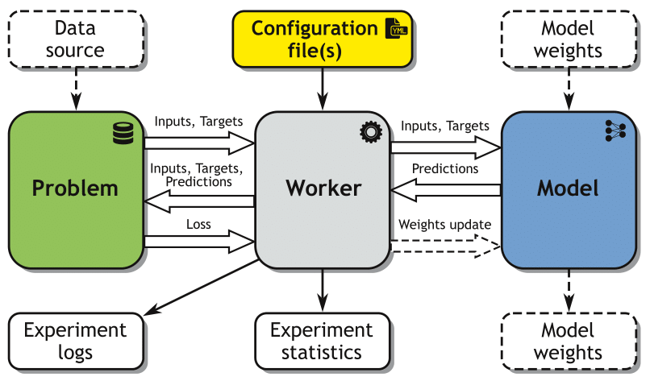
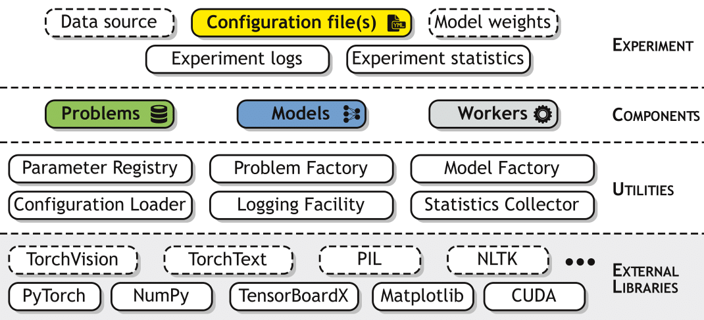
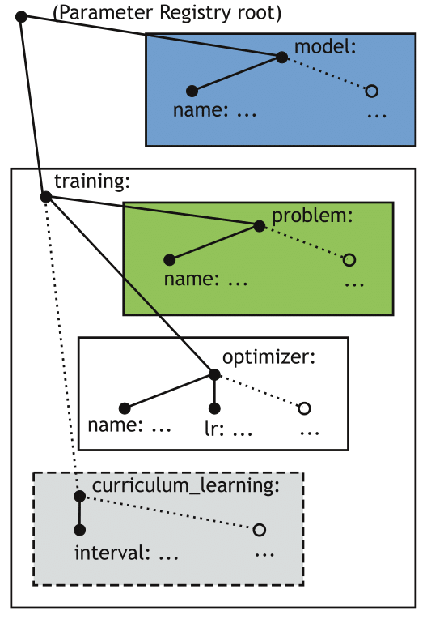
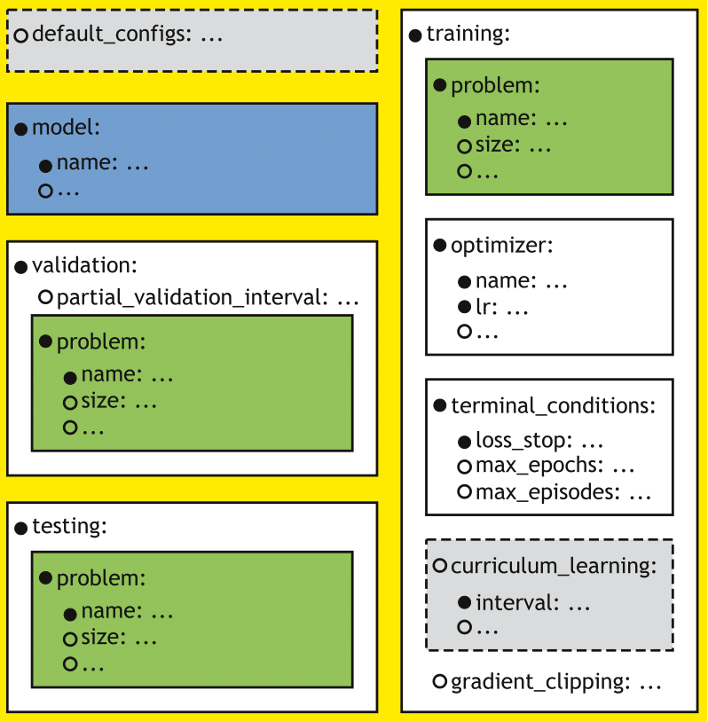

MI-Prometheus Explained
=======================
`@author: Tomasz Kornuta & Vincent Marois`

This page dives deep into MI-Prometheus and its inner workings.

Core concepts
---------------

When training a model, people write programs which typically follow a similar pattern:

    - Loading the data samples & instantiating the model, 
    - Feeding the model batches of image-label pairs, which are passed through the model forward pass,
    - Computing the loss as a difference between the predicted labels and the ground truth labels, 
    - This error is propagated backwards using backpropagation,
    - Updating the model parameters using an optimizer.
    

During each iteration, the program also can collect some statistics (such as the
training / validation loss & accuracy) and (optionally) save the weights of the resulting model into a file.

   The 5 core concepts of Mi-Prometheus. Dotted elements indicate optional inputs/outputs/dataflows.

This typical workflow led us to the formalization of the core concepts of the framework:

    - **Problem**: a dataset or a data generator, returning a batch of inputs and ground truth labels used for a model training/validation/test,
    - **Model**: a trainable model (i.e. a neural network),
    - **Worker**: a specialized application that instantiates the Problem & Model objects and controls the interactions between them.
    - **Configuration file(s)**: YAML file(s) containing the parameters of the Problem, Model and training procedure,
    - **Experiment**: a single run (training & validation or test) of a given Model on a given Problem, using a specific Worker and Configuration file(s).

Aside of Workers, MI-Prometheus currently offers 2 types of specialized applications, namely:

    - **Grid Worker**: a specialized application automating spanning of a number (grid) of experiments.
    - **Helper**: an application useful from the point of view of experiment running, but independent/external to the Workers.
    
General idea here is that Grid Workers are useful in reproducible research, when one has e.g. to train a set of independent models on set of problems and 
compare the results. 
In such a case user can use Helpers e.g. to download required datasets (in advance, before training) and/or preprocess them in a specific way
(e.g. extract features from all images in a dataset once once, with a pretrained CNN model0, which will reduce overall time of all experiments.

Architecture
---------------

From an architectural point of view, MI-Prometheus can be seen as four stacked layers of interconnected modules.

   Architecture of the MI-Prometheus framework.

The layers are as follows:

	- The lowest layer is formed by the external libraries that MI-Prometheus relies on, primarily PyTorch, NumPy and CUDA. Additionally, our basic workers rely on TensorBoardX, enabling the export of collected statistics, models and their parameters (weights, gradients) to TensorBoard. Optionally, some models and problems might depend on other external libraries. For instance, the framework currently incorporates problems and models from PyTorch’s wrapper to the TorchVision package.
	- The second layer includes all the utilities that we have developed internally, such as the Parameter Registry (a singleton offering access to the registry of parameters), the Application State (another singleton representing the current state of application, e.g. whether the computations should be done on GPUs or not), factories used by the workers for instantiating the problem and model classes (indicated by the configuration file and loaded from the corresponding file). Additionally, this layer contains several tools, which are useful during an experiment run, such as logging facilities or statistics collectors (accessible by both the Problem and the Model).
	- Next, the Components layer contains the models, problems and workers, i.e. the three major components required for the execution of one experiment. The problem and model classes are organized following specific hierarchies, using inheritance to facilitate their further extensions.
	- Finally, the Experiment layer includes the configuration files, along with all the required inputs (such as the files containing the dataset, the files containing the saved model checkpoints with the weights to be loaded etc.) and outputs (logs from the experiment run, CSV files gathering the collected statistics, files containing the checkpoints of the best obtained model).

.. See http://docutils.sourceforge.net/docs/ref/rst/directives.html for a breakdown of the options

Configuration Management
------------------------------

Configuration management is one of the fundamental features of the MI-Prometheus framework. Generally, we distinguish three main sources of parameter values:

	- Values passed as arguments when executing a worker from the command line,
	-  Values read from the configuration file(s),
	- Default values initialized in the code.

Command line arguments are parsed at the beginning of the execution of a given worker and include important settings for a worker configuration, such as the name(s) of the configuration file(s) that the worker should load, the output directory etc.
The other two sources of parameters are collected into a unified registry called the Parameter Registry, implemented on the basis of a singleton design pattern, making it shareable between all models, problems and other dependent classes.
The Parameter Registry is initialized with a list of configuration files, resulting in a tree-like structure of key-value pairs, where a particular value can be a nested subtree on its own.

In order to enable loose coupling between the several components of the system, we created a view-based mechanism, where a given component receives access to a particular subtree, without being aware of its location (and locations of other, external subtrees) in the Parameter Registry tree.
When a worker needs to instantiate a given model or problem, it passes a view of the adequate subtree to a factory. After finding the file containing the required class, the factory initializes a new object of this type, passing it the same view.
This mechanism enables a given component to override the default values (i.e. initialized in the code) of certain variables with values loaded from the configuration file, disregarding the absolute location of a given parameter in the Parameter Registry tree.

   A sketch of an illustrative Parameter Registry tree with several views. In this example, the gray box represents a view containing a subtree of parameters related to the training, with nested subtrees for the problem and the optimizer respectively.

Another important feature of the configuration management is that the resulting content of the Parameter Registry tree can come from merging several configuration files. This can be realized in two different ways:

	- By passing more than one filename as a command line argument when executing a worker,
	- By storing the list of filenames in the `default_configs` key of the configuration file.

The latter case allows the nesting of several configuration files, i.e. composing new configuration files from existing ones, thus increasing their reusability.
The developed mechanism first recursively parses the values of the default configs key of every configuration file one by one, creating a list of configuration filenames and then loads them in reverse order.
As a result, the parameter values from the last indicated configuration will overwrite the ones from previously indicated configurations. The resulting configuration will overwrite the default parameters values initialized in the code.

   Configuration sections of a basic trainer/tester. Solid lines indicate mandatory (sub)sections, whereas dotted lines indicate the optional ones.

MI-Prometheus assumes the presence of several mandatory sections: a section defining the model, and sections defining the training, validation and test procedures respectively.

This is supported by the fact that both Trainers combine training with validation, and, moreover, the test procedure is usually designed alongside the training procedure. However, as the three sub-procedures may require different parameter values (e.g. a different sequence length for sequential problems to measure the generalization capabilities of the model), they had to be separated into three sections.

Finally, as the Model usually keeps the same parameters during both training and testing, this resulted in four mandatory sections (which can be imported from other configuration files).

Additionally, it is possible to use optional parameters and subsections.
For example, training can be terminated using early stopping (i.e. stopping if no improvement has been observed for a specified number of episodes/epochs) if the user adds the `early_stop_delta` key to the `terminal_conditions` section (`coming soon`).
Similarly, one can use curriculum learning by adding the adequate subsection to the training section.