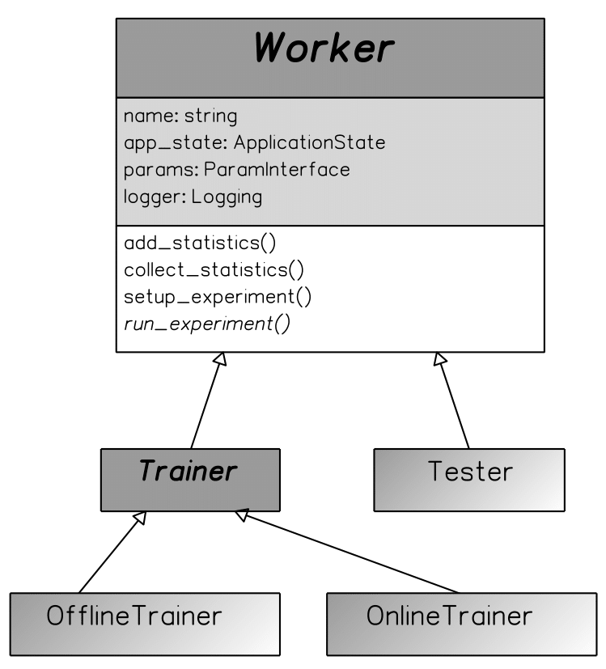
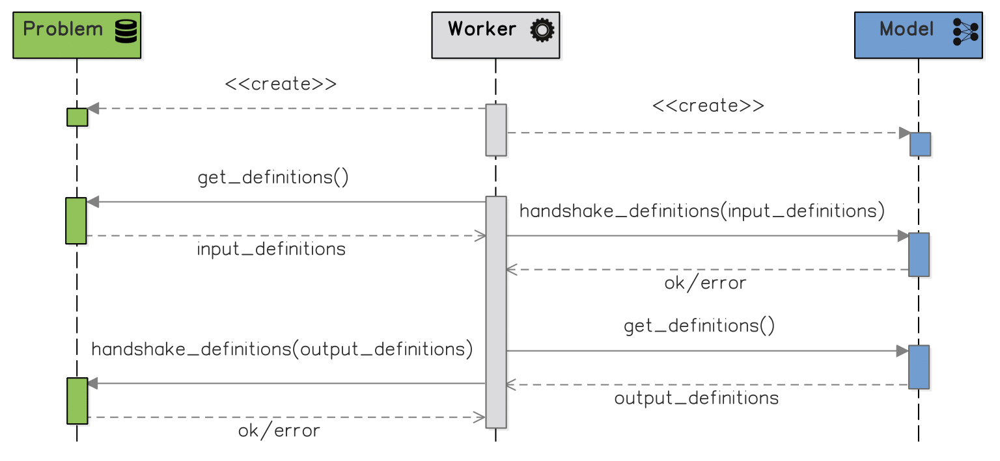
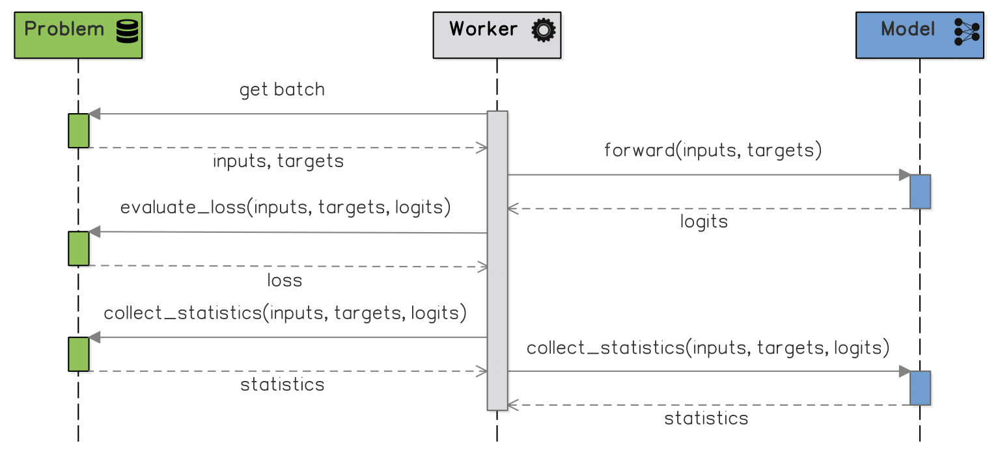
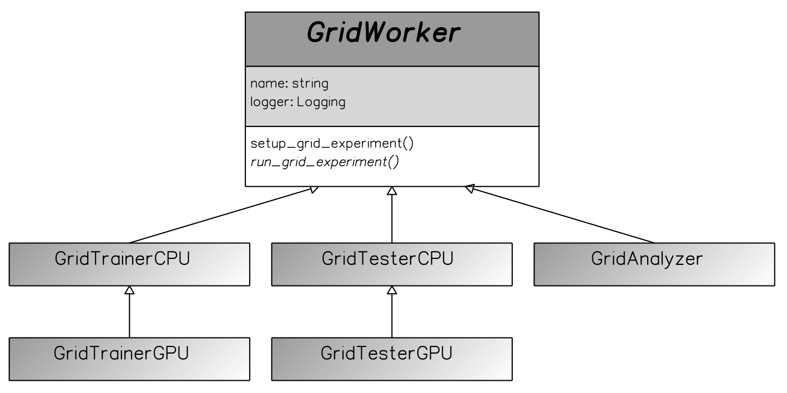

Workers Explained
===================
`@author: Vincent Marois`

Our framework currently offers eight different types of Workers, divided into two classes: Base Workers and Grid Workers.

Base Workers
--------------

The Base Workers are scripts which execute a certain task given a Model and a Problem.
They are related to either the training (Trainers) or the testing procedure (Tester) and can support both CPUs & GPUs.

   The class inheritance of the base workers. The Trainers & the Tester classes inherit from a base Worker class, to follow OOP best practices.

Trainers
^^^^^^^^^^

There are two types of Trainers: Online Trainer and Offline Trainer.

The Offline Trainer is based on epochs and validates the model on the validation set at the end of each epoch. Thus, it is well-suited for finite-size datases, such as MNIST.

While an epoch seems natural for all finite-size datasets, it makes less sense for problems which have a very large, almost infinite dataset (like algorithmic tasks, which generate data `on-the-fly`).
This is why we also developed the Online Trainer, which, instead of looping on epochs, iterates directly on episodes (we call an iteration on a single batch an episode).

By default, the Online Trainer validates the model every `n` episodes on a subset of the validation set, whereas Offline Trainer validates the model on the whole validation set at the end of every epoch. The Offline Trainer can also validates the model every `n` episodes on a subset of the validation set (we refer to this as partial validation), and both trainers validate the model on the whole validation set at the end of training.

Tester
^^^^^^^^^^

The third Base Worker is Tester, which loads a trained model and iterates over the test set once, collecting all the specified statistics (mean loss, accuracy etc.).

Both the Trainers and the Tester share a similar logic of operation. They both also support CPU and GPU working modes. The user can activate this by passing the `––gpu` argument when running a given worker from the command line, which will result in moving the tensors to GPU (e.g. `torch.FloatTensor` to `torch.cuda.FloatTensor`), thus allowing the Model to use CUDA and perform its computations on GPU.

We can distinguish two main phases of functioning for the base workers: the initialization and the iteration over the batches of samples (each such iteration on a single batch is called an Episode) produced by the model.

Initialization:

After loading the configuration file(s) in the Parameter Registry, the worker initializes the logger, creates an output experiment folder and output CSV files, exports the current experiment settings (content of the Parameter Registry) to a file and (optionally) initializes a TensorBoard logger.

Next, it instantiates the problem and model classes using specialized factories. At that point, the Tester also loads the model weights from the checkpoints file indicated by one of the command line arguments (which is optional for the Trainers).

In order to ensure that the Problem and the Model are compatible, both basic workers perform an automated handshaking, to check whether the definitions (i.e. name, type and shape when relevant) of the inputs produced by the Problem match the required definitions of the Model inputs. They also verify if the definitions of the model’s predictions match the definitions of the Problem targets and are compatible with the used loss function.

   The most important interactions between Worker, Model & Problem during the initialization phase.

Iterations over the batches of samples:

In every episode, the Worker retrieves a batch of samples from the Problem, inputs it to the Model, collects the Model’s predictions and passes them back to the Problem in order to compute the loss (and other statistics, such as accuracy).

At the end of the episode, all events and collected statistics are logged to the experiment folder & files.
The Trainers performs several additional computations afterwards. First of all, they perform the model optimization, i.e. updating the model weights using error backpropagation and an optimizer (indicated in the configuration file). They also validate the Model, as explained above.

If visualization is active, the Trainers also display the current behavior of the Model, through a visualization window specific to the Model.
Finally, they also export the Model along with the collected statistics to a checkpoint file.

   The interactions between the Worker, Problem and Model during a single episode, which are shared between the Trainer and the Tester.

Training ends when one of the following conditions is met:

    - The epoch limit is reached (for the Offline Trainer),
    - The episode limit is reached (for the Online Trainer),
    - The validation loss goes below a certain threshold. We consider the average loss over the entire validation set for the Offline Trainer, and the partial validation loss for the Online one.

Grid Workers
--------------

Additionally, there are five Grid Workers, i.e. scripts which manage sets of experiments on grids of CPUs/GPUs.
These are:

    - two Grid Trainers (separate versions for collections of CPUs and GPUs) spanning several trainings in parallel,
    - two Grid Testers (similarly),
    - a single Grid Analyzer, which summarizes the results of several trainings & tests into one csv file.

The Grid Trainers and Testers in fact spawn several instances of base Trainers and Testers respectively.
The CPU & GPU versions execute different operations, i.e. the CPUs grid workers assign one processor for each child, whereas the GPUs ones assigns a single GPU instead.

Fig. 7 presents the most important sections of the grid trainer configuration files. Section grid tasks defines the grid of experiments that need to be executed, reusing the mechanism of default configuration nesting.
Additionally, in grid settings, the user needs to define the number of repetitions of each experiment, as well as the maximum number of authorized concurrent runs (which later on will be compared to the number of available CPUs/GPUs). Optionally, the user might overwrite some parameters of a given experiment (in the overwrite section) or all experiments at once (grid overwrite).

As a result of running these Grid Trainers and Testers, the user ends up with an experiment directory containing several models and statistics collected during several training, validation and test repetitions. The role of the last script, Grid Analyzer, is to iterate through those directories, collecting all statistics and merging them into a single file that facilitates a further analysis of results, the comparison of the models performance, etc.

   The class inheritance of the grid workers. The Trainers & the Tester classes inherit from a base Worker class, to follow OOP best practices.