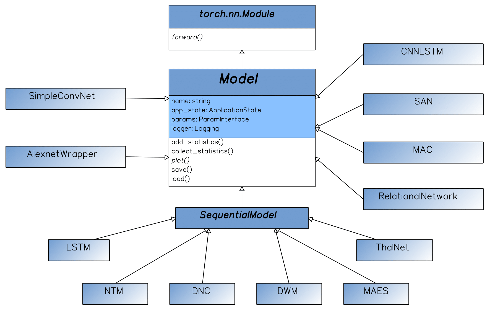

Models Explained
===================
`@author: Tomasz Kornuta & Vincent Marois`

From the application point of view, the models are the most important components of the system, as the main goal of
the MI-Prometheus framework is to facilitate the development and training of new models.

Currently, the framework contains a suite of models that can be divided into three categories.

The first category includes several classic models, such as AlexNet (Krizhevsky & Hinton, 2009) or the LSTM (Long-Short Term Memory) (Hochreiter & Schmidhuber,
1997). Those wrapper classes, aside of being common baselines, are examples showing how one should incorporate external models into MI-Prometheus.

Other classical models that we incorporated are sequence-to-sequence models for neural translation such as a LSTM-based encoder-decoder (Sutskever et al., 2014) and its variation with GRUs and attention (Bahdanau et al., 2014).

The second category includes Memory-Augmented Neural Networks (Samir, 2017). It includes some well-acclaimed models, such as the NTM (Neural Turing Machine) (Graves et al., 2014) or the DNC (Differentiable Neural Computer) (Graves et al., 2016),
alongside several new architectures, e.g. ThalNet (Hafner et al., 2017).

The third category includes models designed for the VQA (Visual Question Answering) (Antol et al., 2015) problem domain. Here, MI-Prometheus currently offers some baseline models (e.g. a CNN coupled with an LSTM) and several state-of-the-art models such as SANs (Stacked Attention Networks) (Yang et al., 2016) RNs (Relational Networks) (Santoro et al., 2017) or MAC (Memory Attention Composition) (Hudson & Manning, 2018).

Each model defines several methods and attributes:

    - A forward pass, resulting in predictions,
    - A plot function, creating a dynamic visualization of parameters of the model during execution,
    - A definition of the inputs that it expects/accepts,
    - Getter & setter methods for the collected statistics.
    - Getter & setter methods for the statistics which are `aggregated` based on the collected statistics: This enables to compute e.g. the mean, min, max, std of the loss or accuracy over an epoch or the whole validation set.

   The class inheritance of the models.

The base `Model` class defines useful features for all models, such as an instance of the Application State, the Parameter Registry or the logger.
This base class inherits from `torch.nn.Module` to access the `forward` method, and have its weights be differentiable.

We also defined a `SequentialModel` class which can be subclassed by recurrent or sequential models, such as MANNs.