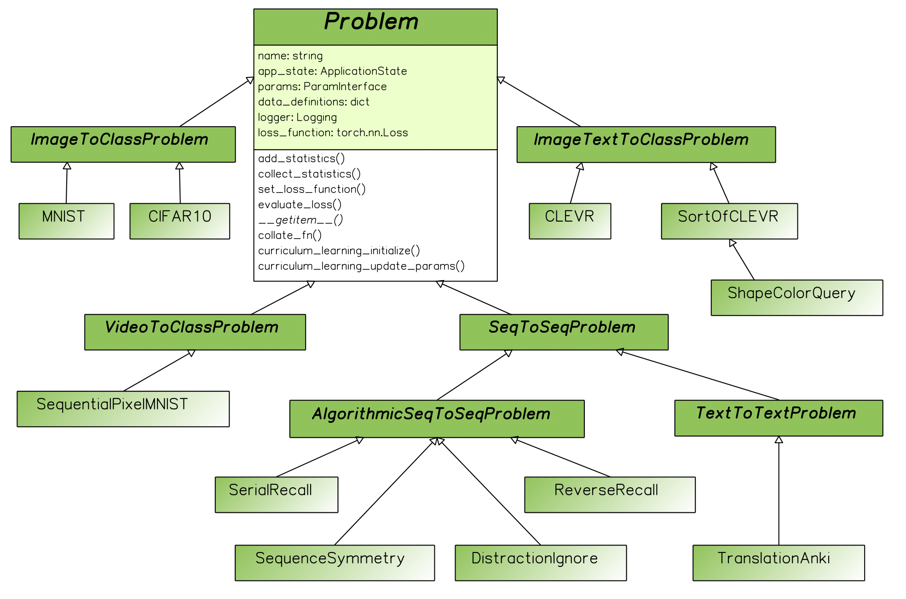

Problems Explained
===================
`@author: Tomasz Kornuta & Vincent Marois`

A Problem class generalizes the idea of a dataset (a limited set of samples, already generated) with a data generator (a potentially unlimited set of samples, generated `on-the-fly`).
Its main role is twofold: generate batches of samples (e.g. loading them from disk or generating them `on-the-fly`) and compute metrics such as the loss and accuracy, which are typically dependent on the type of problem at hand.

In MI-Prometheus, we created a hierarchy of classes that follows a taxonomy driven by the input-output combinations.
For instance, MNIST is derived from the abstract `ImageToClassProblem` class, which itself inherits from the main `Problem` class.
TranslationAnki (a toy machine translation problem) is derived from the abstract `TextToTextProblem` class, which inherits from
the `SequenceToSequenceProblem` class, derived finally from the main Problem class.

Such a hierarchy speeds up the integration of new problem classes, as similar problems share common characteristics (same loss function, same metrics, same definition of the data structures, etc.)
and limits the amount of code to write.

It is also straight-forward to impact all problem classes (e.g. adding a new feature) by implementing it in the base Problem class.

It is worth noting that the abstract base Problem class is derived from the PyTorch Dataset_ class.
This enables to incorporate the usage of concurrent data loading workers (through the use of PyTorch’s DataLoader_).

.. _Dataset: https://pytorch.org/docs/stable/data.html#torch.utils.data.Dataset
.. _DataLoader: https://pytorch.org/docs/stable/data.html#torch.utils.data.DataLoader

This feature works with all MI-Prometheus problem classes by default.
Hence, every problem class defines (through inheritance or directly) several methods & attributes (among others):

    - The necessary functions `__getitem__` , `len` and `collate`, used by PyTorch’s DataLoader,
    - The used loss function and a method `evaluate_loss`,
    - A definition of the inputs that it expects/accepts,
    - Getter & setter functions for the collected statistics.
    - Getter & setter methods for the statistics which are `aggregated` based on the collected statistics.

   The class inheritance of the problems. For clarity, we present only the most important fields and methods of the base Problem class.

The figure above presents a class diagram with a subset of problems that are currently present in the framework, starting from classical image classification (such as MNIST and CIFAR10), machine translation (TranslationAnki)
or Visual Question Answering (e.g. CLEVR (Johnson et al., 2017) and SortOf-CLEVR (Santoro et al., 2017)).
It also contains several algorithmic problems such as SerialRecall and ReverseRecall used in (Graves et al., 2014).
