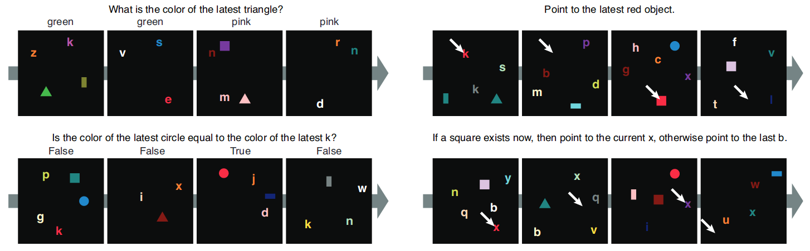

.. _cog-experiments:

Testing working memory using Cog dataset and model
=================================================================================
`@author: Emre Sevgen`

This note will explain how to partially reproduce the results of Cog model on the Cog dataset with our implementation.

Please refer to the paper_ for a full description of the experiments and the analysis of the results.

.. admonition:: Abstract

     A vexing problem in artificial intelligence is reasoning about events that occur in complex, \
     changing visual stimuli such as in video analysis or game play. Inspired by a rich tradition of\
     visual reasoning and memory in cognitive psychology and neuroscience, we developed an artificial, \
     configurable visual question and answer dataset (Cog) to parallel experiments in humans and animals. \
     Cog is much simpler than the general problem of video analysis, yet it addresses many of the \
     problems relating to visual and logical reasoning and memory -- problems that remain challenging for \
     modern deep learning architectures. We additionally propose a deep learning architecture that performs \
     competitively on other diagnostic VQA datasets (i.e. CLEVR) as well as easy settings of the Cog dataset. \
     However, several settings of Cog result in datasets that are progressively more challenging to learn. \
     After training, the network can zero-shot generalize to many new tasks. Preliminary analyses of the \
     network architectures trained on Cog demonstrate that the network accomplishes the task in a manner \
     interpretable to humans. 

.. _paper: https://arxiv.org/abs/1803.06092

In this note, we will go through the following experiments for the Cog model:

    - Training and testing on the Cog dataset on canonical difficulty

On the Cog Dataset
------------------------------------------

The Cog dataset is a sequential visual question anwering dataset. Each datapoint consists of a question, 
a sequence of images, and a sequence of answers. The question is drawn from a family of 44 tasks. Images
consist of geometric objects and letters of various colors on a black background, and the answers take the form
of classification or pointing. Below is four examples provided in the original paper:

   
   Four sample datapoints illustrating classification and pointing tasks from the Cog dataset. See https://arxiv.org/abs/1803.06092 for more details.

The dataset is randomly generated as described in the paper. Key variables are:

    - Sequence Length: Length of the datapoint sequence. In the above example, this is set to 4.
    - Max Memory Duration: How far back in sequence the object critical for the answer can be.
    - Max Nr of Distractors: The limit of number of non-answer critical objects. 

There are two pre-generated datasets provided, canonical and hard. Canonical dataset uses:

    - A sequence length of 4
    - A max memory duration of 3
    - Max distractors of 1 

Hard dataset uses:

    - A sequence of length of 8
    - A max memory duration of 7
    - Max distractors of 10

Both datasets and the Cog model can all be downloaded from GitHub_.

.. _GitHub: https://github.com/google/cog

In addition, it is possible to generate a dataset from scratch for the same or different combinations of variables.
In Mi-Prometheus, a new Cog dataset can be generated using a config file and any trainer. A sample generation config
file is provided in 'mi-prometheus/configs/cog/cog_generate.yaml' with parameters to generate a tiny dataset on 
the Hard setting.

Training the Cog model on the Cog dataset
------------------------------------------

The first step is to ensure that you have Mi-Prometheus up and running. Please refer to the :ref:`installation` note,
and do no hesitate to read the :ref:`explained` section, which provides in-depth information about Mi-Prometheus.

The first experiment is to train :py:class:`miprometheus.models.cog.CogModel` 
on :py:class:`miprometheus.problems.Cog`.

Though data can be pre-generated, we will use the provided canonical dataset. This dataset includes a training set, 
a validation set and a test set. If datasets aren't already downloaded, MI-Prometheus will download and unzip them for you at '~/data'.

The training set of Cog contains 227,280 samples per task family, across 44 task families for a total of 10,000,320 samples.
By default, the canonical dataset will be placed in '~/data/cog/data_4_3_1/'

The configuration file is provided in 'mi-prometheus/configs/cog/cog_cog.yaml'

This configuration file contains all the parameters for training & validation.

Simply run

    >>> mip-online-trainer --c cog_cog.yaml --tensorboard 0 (--gpu)

The first option points to the configuration file.
The second option will log statistics using a Tensorboard writer. This will allow us to visualize the models convergence plots.
The last option, if passed, will enable training on the gpu if one is available.

.. note::

    Training on the entire dataset will take ~ 60h on a Titan X GPU.

The :py:class:`miprometheus.workers.OnlineTrainer` (called by ``mip-online-trainer``) wil create a main
experiments folder, named `experiments/<timestamp>` which will contain the statistics.

Testing the trained models on the Cog test dataset
---------------------------------------------------

To be completed.

Collecting the results
----------------------

To be completed.

Training the Sequential MAC model on the Cog dataset
------------------------------------------

